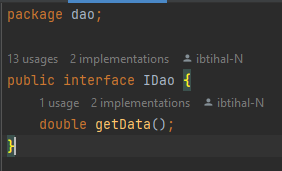
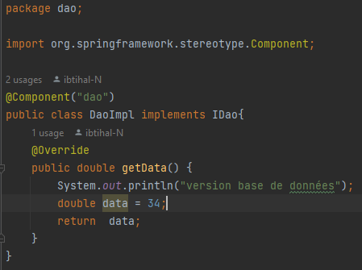
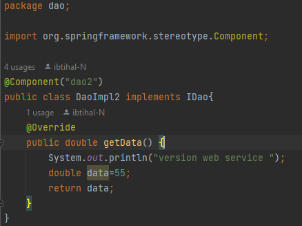
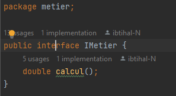
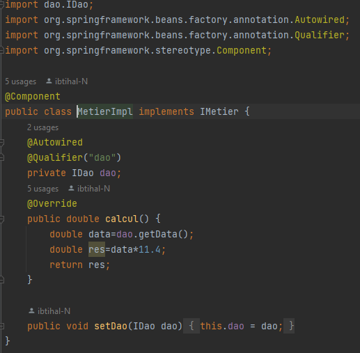
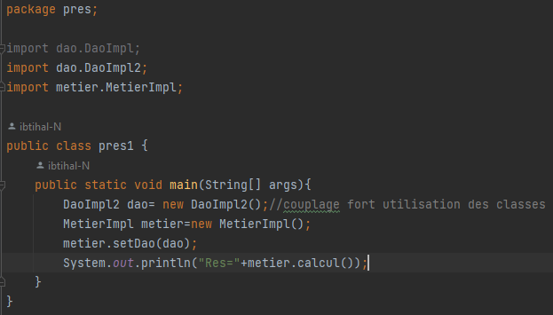
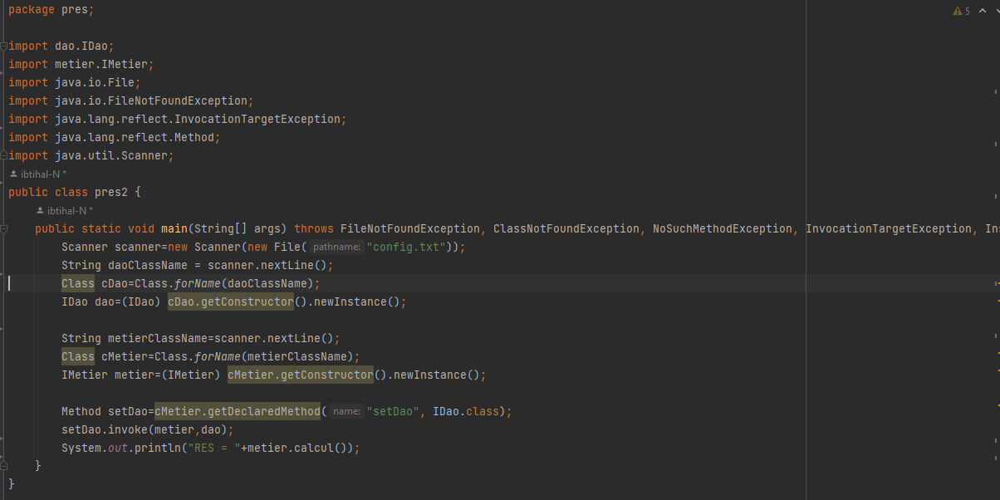
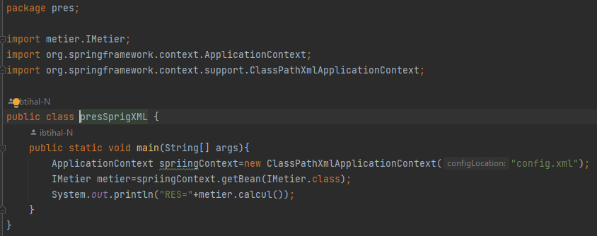
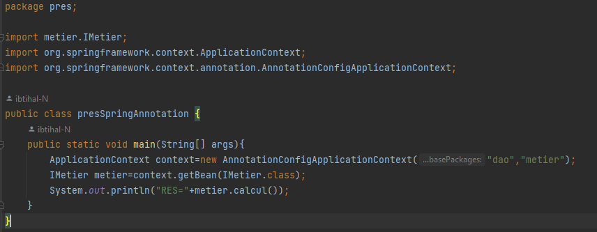

<h3>Activité Pratique N°1 - Inversion de contrôle et Injection des dépendances</h3>

1. Création de l'interface IDao avec une méthode getDate

2. Créer une implémentation de cette interface 

3. Créer l'interface IMetier avec une méthode calcul

4. Créer une implémentation de cette interface en utilisant le couplage faible

5. Faire l'injection des dépendances :
  
a. Par instanciation statique

5. Faire l'injection des dépendances :
  
b. Par instanciation dynamique

5. Faire l'injection des dépendances :

c. En utilisant le Framework Spring

  
- Version XML

5. Faire l'injection des dépendances :

c. En utilisant le Framework Spring

  
- Version annotations

  
  
       
       
